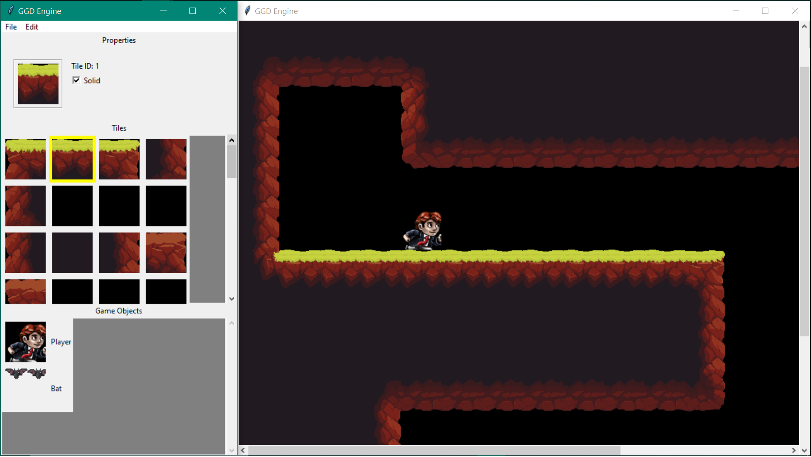
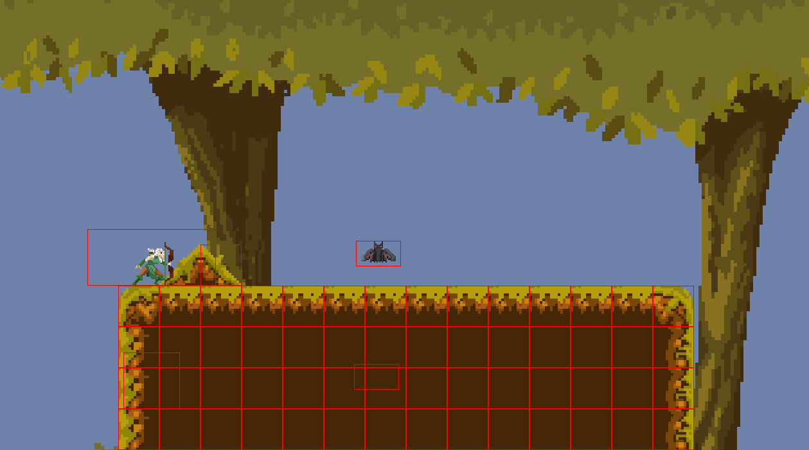
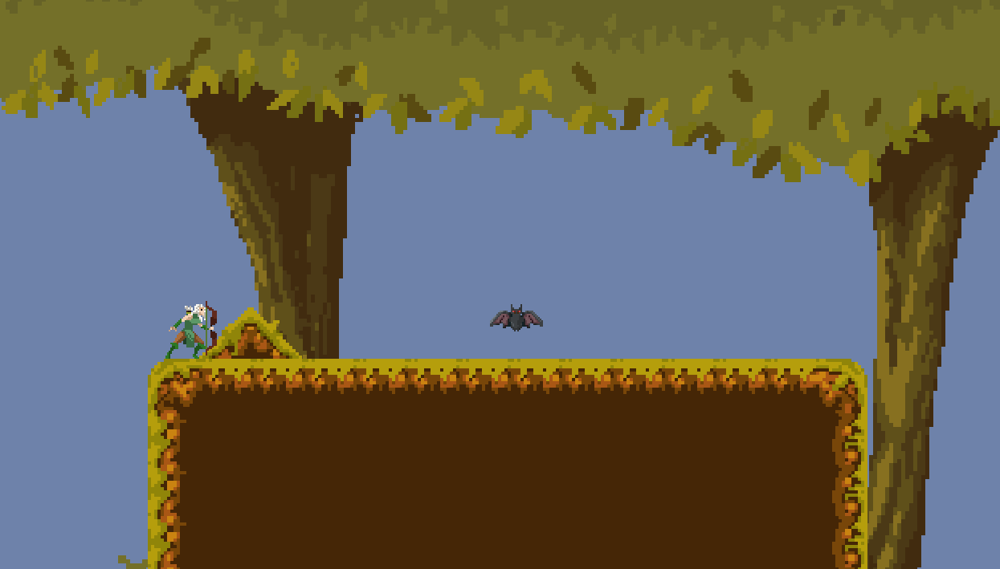
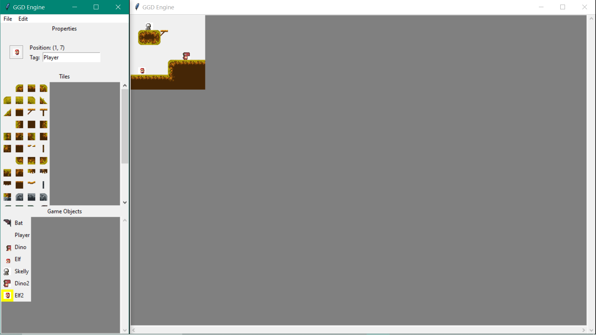

## Welcome to the Games Get Developed Site

### Trailer
#### Editor Trailer

#### Engine Trailer

### Screen Shots
#### Game
##### Debug Mode

##### Normal

#### Editor

### Documentation
<a href="GGDSite/Docs/">Documentation here</a>

### Engine Architecture Diagram

### Binary

### Post Mortem

   For our TileMap Editor we wanted to create an environment where the user could easily load up any sprite sheets that they had, and have the tiles or gameobject within that sprite sheet be easily accessible to them within our environment. They would be able to see all of the individual tiles displayed in a grid with the properties for each tile being displayed when you click on that tile. Then being able to paint that tile into the game world, and ideally also be able to paint background tiles into the world. We also wanted to be able to have a displayed hierarchy of all of the different game objects within the level and give the user accessibility to change any aspects of the gameobject that they would want. In our current iteration we provide the user the ability to visually paint their tiles onto a tile map, and also visually place game objects onto the tilemap. We also allow the user to edit specific settings about the gameobjects. If we were given an extra 8 weeks to improve on our current design we would most likely spend most of it working on updating user experience. I believe Tkinter would still work fine for the basics of building up what we already have, and it does it's job well enough for our purpose. The actual work that we would allote most of our time into is cleaning up the UI so it is much simpler and easier for the user to see and edit what information they would like to edit. As the information panel currently only has set information that we pre-determined that the user would be able to edit. It would be nice if the user was able to add any other parameters that they believe that the object or tile should have, such as maybe allowing for moving tiles and such. And being able to add user customizability to the interface so that they could move the windows to specific areas that they feel would be better for their specific work.

   Our Engine has a lot of work put into it in order to make sure that everything is working properly. It pulls JSON files that are produced from our Editor and is able to turn them into playable levels, and it also reads through a JSON with a list of all of the GameObjects on that level. However that feature was not able to be fully produced in time for this assignment, if there was an extra 8 weeks of time we would be able to properly implement this function fully to be able to incorporate the full capabilities of our editor. 
   
   For bugs and problems that we encountered, there were 2 big ones that ended up cutting into a lot of our developement time. The first was that as we started exposing our collision logic into the python, we began to have some really glaring issues with collision detection. This was in part caused by the second issue, which was us not realizing certain primative types weren't being assigned default values that need to have those default values. This was leading to undefined behaviour that was causing us to think our logic itself was incorrect in a number of places, including our collision, which in turn caused us to waste quite a bit of time trying to track down the error before we realized that it was being caused by the uninitialized variables. Our collision detection itself had some rather glaring issues in regards to scalability of the objects that were coliding that we had to spend quite a bit of time fixing to get them to collide properly.

